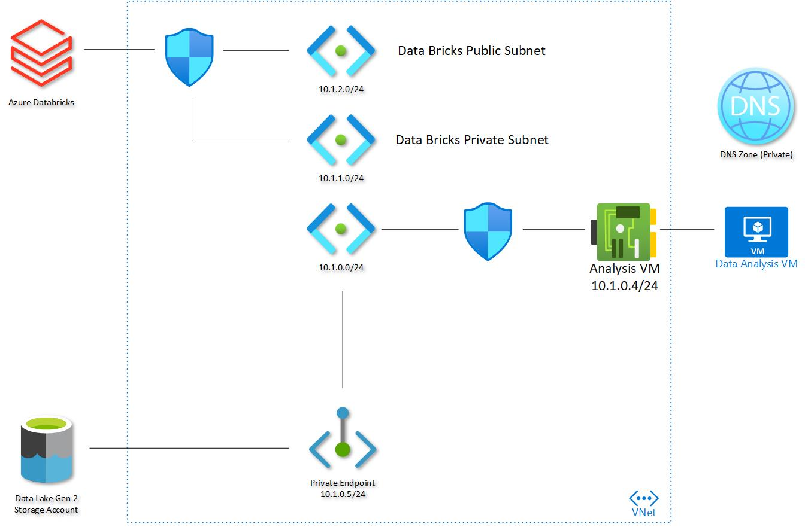

# Azure High Level Design
 

## Azure Data Lake, Databricks and Analyst Virtual Machine - closed network configuration
This article provides a template for deployment of Azure Data Lake Gen2 and Azure Databricks.

# Overview
This template deploys an [Azure Data Lake Gen2][DataLakeGen2Docs], an Azure VM and an Azure Databricks instance.  All three are configured to use a single VNet with multiple subnets with no public access to the services.
The ADL is an Azure StorageV2 Account with heirachial namespace enabled which is configured as the data store.  The Azure VM acts as the Data Analyst VM which can have tools installed to access the services within the VNet.  The Databricks instance is configured in Private mode and the Public and Private subnets are Internal only, ensuring that no access the the service API can occur outside the VNet.

# Networking
The Virtual machine is configured with a single NIC which is bound to the default subnet of 10.1.0.0/24.  There is an NSG on the vNIC which blocks all ports except from the VNet, so other subnets in the same VNet can be accessed.  To access this virtual machine from the portal, or from a remote location a [Public IP would have to be added to the virtual machine.][PublicIP]

The ADL Storage account has all public access disabled, and has a Private Endpoint configured to attach to the default subnet alongside the VM.  This ensures that no services outside the Vnet can access the storage account.  

A private DNS zone has also been configured for the Vnet to allow for dynamic updates and name resolution of the ADL Storage Account Private Endpoint.  Any services using the VNet can query the name adlaccout1.privatelink.blob.core.windows.net and reach the Storage Account directly by [resolving the name in the private DNS zone.][PrivateDNS]

The Azure Databricks is [configured with VNet injection enabled][DataBricksVnet].  This requires the creation of two subnets in the existing VNet which are bound to the Public and Private endpoints of the Databricks services.

# Further configuration
Once this template is deployed, the ADL will be required to be connected to the Databricks instance.  Please see the tutorial below for the instructions on how to perform this.  The key parts to pay attention to are the prerequisites - one of these is to [create a Service Principal][ServicePrincipal] which allows you to provision application access to the ADL, only giving it the rights it requires, and ensuring you do not need to provision access for all users individually.

Connect ADL to Databricks
* [Tutorial: Azure Data Lake Storage Gen2, Azure Databricks & Spark | Microsoft Docs][AdlToDataBricksConfig]

<!-- Local -->
[Design]: images/highleveldesign.jpg

<!-- External -->
[AdlToDataBricksConfig]: https://docs.microsoft.com/en-us/azure/storage/blobs/data-lake-storage-use-databricks-spark
[DataLakeGen2Docs]: https://docs.microsoft.com/en-us/azure/storage/blobs/data-lake-storage-introduction
[PublicIP]: https://docs.microsoft.com/en-us/azure/virtual-network/ip-services/associate-public-ip-address-vm
[PrivateDNS]: https://docs.microsoft.com/en-us/azure/dns/private-dns-privatednszone
[DataBricksVnet]: https://docs.microsoft.com/en-us/azure/databricks/scenarios/quickstart-create-databricks-workspace-vnet-injection
[ServicePrincipal]: https://docs.microsoft.com/en-us/azure/active-directory/develop/howto-create-service-principal-portal
[PrivateLink]: https://docs.microsoft.com/en-us/azure/private-link/private-link-overview